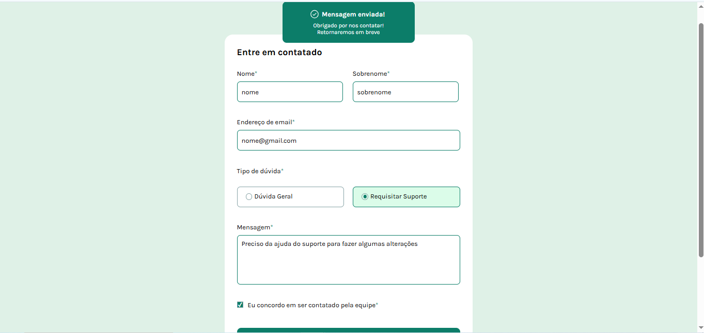
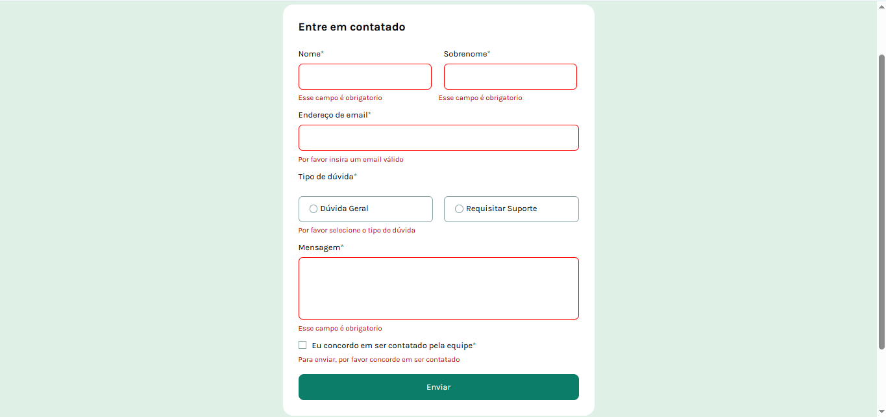
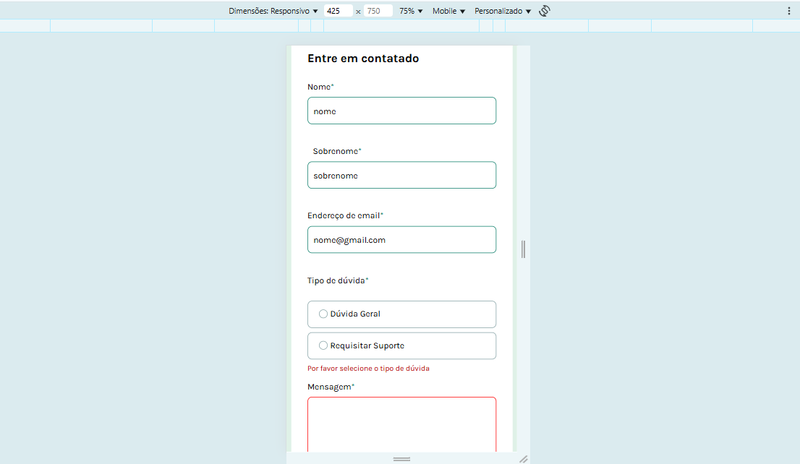

# Frontend Mentor - Contact Form Solution


## 📸 Preview


---

## 🛠️ Tecnologias utilizadas

- HTML5
- CSS3 (responsivo)
- JavaScript puro (vanilla JS)
- Google Fonts (Karla)

---

## 💻 O desafio

O objetivo era desenvolver um formulário de contato com validação de campos obrigatórios, feedback visual e mensagem de sucesso ao enviar.

Os usuários devem ser capazes de:

- Preencher e enviar o formulário
- Ver uma mensagem de sucesso após o envio
- Receber mensagens de erro se:
  - Algum campo obrigatório não for preenchido
  - O e-mail não estiver em formato válido
- Navegar usando apenas o teclado
- Visualizar estilos de foco e hover para elementos interativos
- Ter uma experiência acessível com leitores de tela

---

## 📦 Funcionalidades implementadas

- ✅ Validação personalizada com JavaScript
- ✅ Mensagens de erro visuais e ocultas por padrão
- ✅ Destaque visual nos campos com erro
- ✅ Feedback visual nos botões radio selecionados
- ✅ Mensagem de sucesso após envio
- ✅ Layout 100% responsivo

---

## 🧠 O que aprendi

Durante esse desafio, aprendi e pratiquei:

- Validação de formulário com JavaScript sem bibliotecas
- Manipulação do DOM para mostrar/ocultar erros dinamicamente
- Aplicar estilos personalizados em radio buttons e checkboxes
- Responsividade com Flexbox e boas práticas de CSS
- Acessibilidade básica para formulários

---

## 🖼️ Captura de tela





---

🧑‍💻 Autor
GitHub: [@dhBarankievicz](https://github.com/dhBarankievicz)

---

## 🔗 Site publicado
👉 [Clique aqui para acessar o site](https://dhbarankievicz.github.io/frontend-mentor-Contact-form/)

---

## 📁 Estrutura do projeto

```bash
├── assets/
│   └── images/
├── index.html
├── style.css
├── script.js
└── README.md

